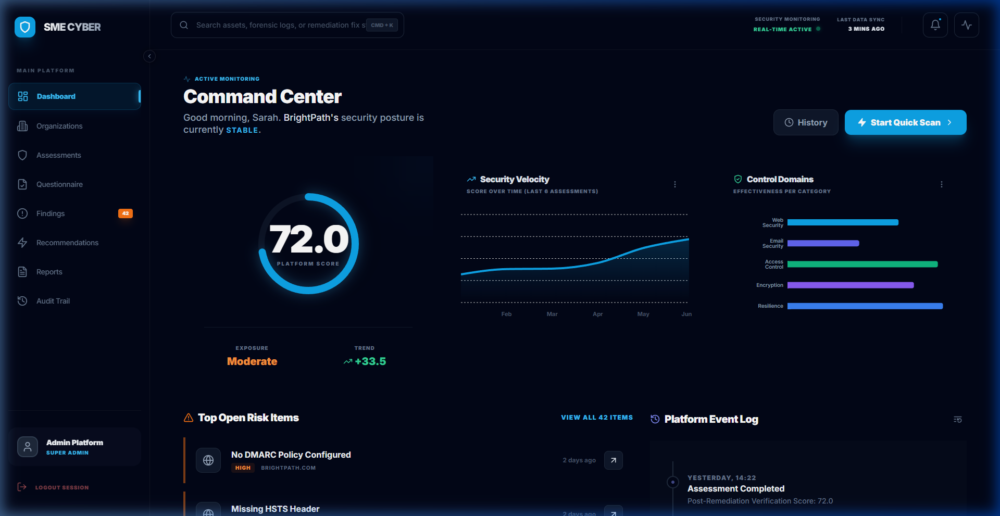
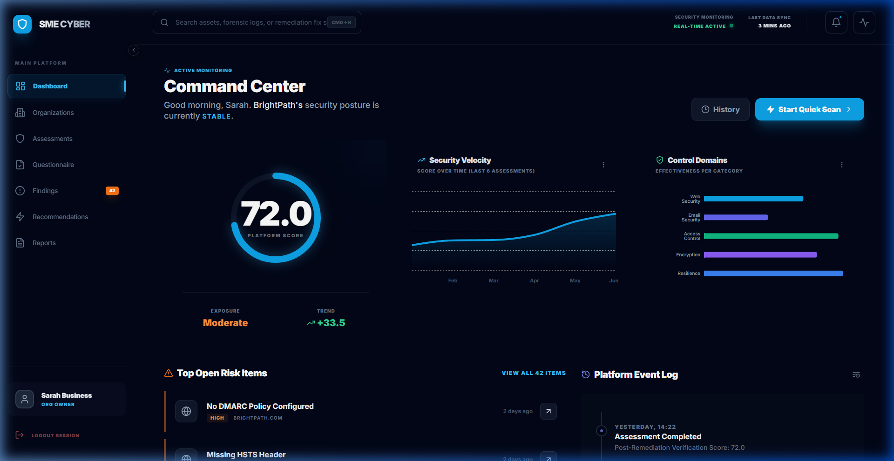
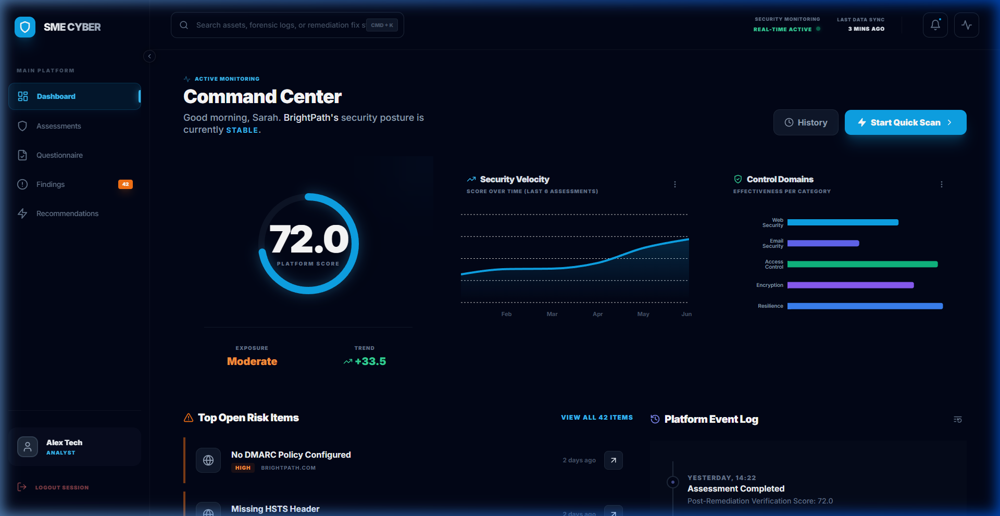
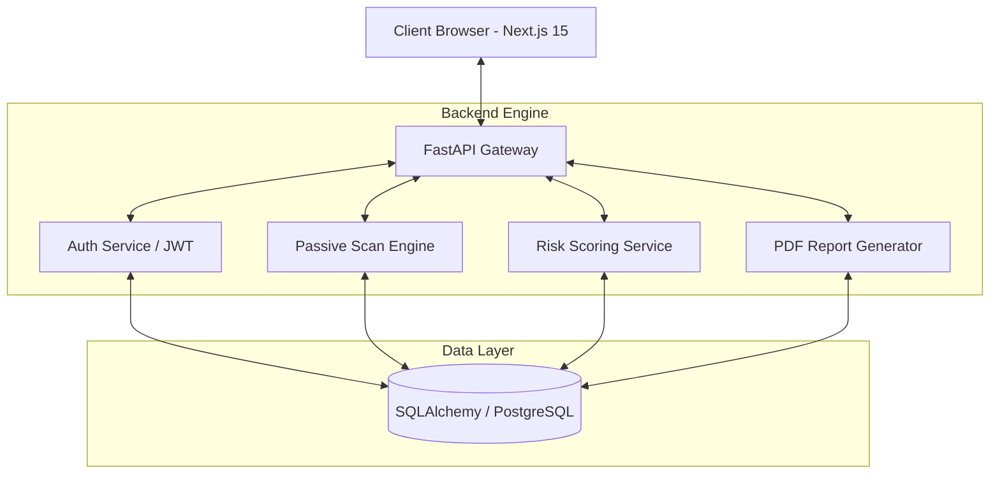
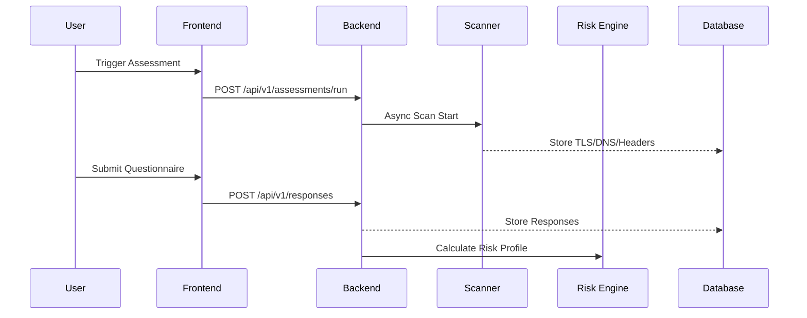
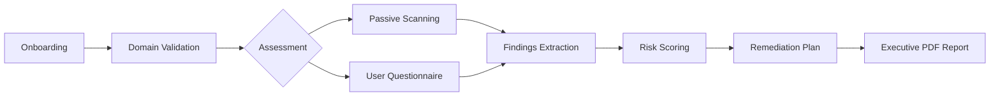
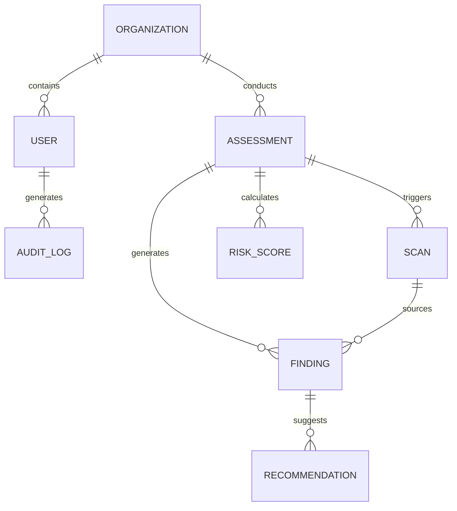

<div align="center">

# 🛡️ Codex SME Cyber

**Modern Cybersecurity Posture Management for SMBs**

[](https://nextjs.org/)
[](https://fastapi.tiangolo.com/)
[](https://tailwindcss.com/)
[](https://www.typescriptlang.org/)
[](https://www.postgresql.org/)
[](https://www.docker.com/)

> **Identify risks. Understand impact. Prioritize remediation.**
>
> *An professional-grade security assessment platform designed to bridge the gap between complex enterprise tools and expensive manual consulting.*

[Overview](#-overview) • [Features](#-key-features) • [Architecture](#-architecture) • [Screenshots](#-visual-walkthrough) • [Getting Started](#-getting-started) • [RBAC](#-role-based-access-control)

</div>

---

## 📖 Table of Contents
- [🔭 Overview](#-overview)
- [🧭 Key Features](#-key-features)
- [🏗️ Architecture](#-architecture)
- [📁 Project Structure](#-project-structure)
- [📽️ Visual Walkthrough](#-visual-walkthrough)
- [🔄 System Workflow](#-system-workflow)
- [🗄️ Database Schema](#-database-schema)
- [👥 Role-Based Access Control](#-role-based-access-control)
- [⚙️ Advanced Platform Features](#-advanced-platform-features)
- [🛠️ Tech Stack](#-tech-stack)
- [🚀 Getting Started](#-getting-started)
- [📄 License](#-license)


---

## 🔭 Overview

**Codex SME Cyber** is a professional-grade cybersecurity posture management platform specifically engineered for small and medium-sized businesses (SMBs). While enterprise security tools are often too complex and expensive, and manual consulting is out of reach for many, our platform bridges the gap by providing automated intelligence, guided assessments, and actionable remediation roadmaps.

The platform provides a "Single Pane of Glass" for business owners and technical analysts to:
1. **Identify** external vulnerabilities through non-intrusive domain scanning.
2. **Evaluate** internal security maturity via expert-guided questionnaires.
3. **Analyze** risk using a sophisticated, weighted scoring engine.
4. **Remediate** issues with a prioritized roadmap mapped to industry frameworks.
5. **Report** findings through executive-level and deep-tech PDF exports.

---

## 👨‍💻 Developer & Project Context

| | |
| :--- | :--- |
| **Developer** | [Anand Binu Arjun](https://github.com/AnandBinuArjun) |
| **Project Type** | Cybersecurity Capstone |
| **Domain** | Risk Management / Offensive Security (Passive) / SaaS |
| **Status** | ✅ Production Ready |

---

## 📽️ Visual Walkthrough

### 🚀 Command Center (Super Admin)

The primary dashboard for platform-wide oversight, showing real-time security velocity and active monitoring status.


### 👥 Multi-Role Interface

The system dynamically adapts its interface based on the logged-in user's role (Org Owner, Analyst, Viewer).

| Org Owner | Security Analyst |
| :--- | :--- |
|  |  |

---

## 🧭 Key Features

### 🔍 Intelligence & Analysis

- **Passive Domain Scanning**: Automated checks for TLS/SSL, DNS records (SPF, DMARC, DKIM), and Security Headers (CSP, HSTS).
- **Guided Questionnaires**: Category-based readiness checks with weighted risk scoring.
- **Risk Scoring Engine**: Sophisticated algorithm that merges technical scan data with organizational maturity responses.
- **Remediation Roadmap**: Prioritized "Fix List" with effort-level estimations and business impact analysis.

### 🔐 Platform Governance

- **Granular RBAC**: Permission-hardened access for Super Admins, Org Owners, Technical Analysts, and Read-only Viewers.
- **Secure Authentication**: JWT-based session management with bcrypt password hashing.
- **Tenant Isolation**: Strict logical separation of data between organizations (Multi-Tenancy).
- **Immutable Audit Trail**: Detailed logging of all sensitive actions (Logins, Role Changes, Report Downloads) for compliance.
- **Domain Verification**: DNS TXT and email-based verification to ensure authorized scanning only.

---

## 🏗️ Architecture

### High-Level System Design

The platform uses a decoupled frontend/backend architecture for scalability, localized within a Docker container environment.



### Module Interaction Flow

How data moves from a raw scan to a business-ready executive report.



---

## 📁 Project Structure

### 🖥️ Frontend (Next.js)
```text
frontend/src/
├── app/               # Page routes and layouts (App Router)
├── components/        # Reusable UI components (Layout, UI, Features)
├── lib/               # Utility functions and API client
└── public/            # Static assets and screenshots
```

### ⚙️ Backend (FastAPI)
```text
backend/app/
├── api/               # API endpoints (v1) and dependencies
├── core/              # Global configuration and security settings
├── db/                # Database session and base model definitions
├── models/            # SQLAlchemy database models
├── schemas/           # Pydantic validation schemas
├── services/          # Business logic and coordination layer
└── main.py            # Application entry point
```

### 📦 Infrastructure & Config
- `docker-compose.yml`: Multi-container orchestration (App + DB)
- `Dockerfile`: Container image definitions for both services
- `start.bat`: One-click local development startup script

---

## 🔄 System Workflow

The typical lifecycle of a cybersecurity posture assessment within the dashboard.



---

## 🗄️ Database Schema

Simplified ERD showing the core entity relationships.



---

## 👥 Role-Based Access Control

The platform implements a professional, multi-layered security model to ensure data integrity and least-privilege access.

### The Four Security Layers

1. **Authentication**: Identity verification via JWT and bcrypt password hashing.
2. **Authorization**: Backend-enforced permission checks (Real authorization happens at the API level, not just the UI).
3. **Data Scope**: Tenant isolation ensures users can only access data belonging to their specific organization.
4. **UI Personalization**: Dashboards and navigation dynamically adapt to the user's role and technical needs.

### Primary Roles

- 🔴 **Super Admin**: Platform-level governance. Manages users, organizations, and global templates.
- 🟠 **Org Owner**: Business decision-maker. Manages the organization profile, invites team members, and tracks overall risk.
- 🟡 **Security Analyst**: Technical operator. Runs scans, reviews raw evidence, and manages the remediation workflow.
- 🟢 **Viewer / Auditor**: Read-only oversight. Accesses dashboards and reports for compliance and management review.

### Detailed Permission Matrix

| Feature | Super Admin | Org Owner | Analyst | Viewer |
| :--- | :---: | :---: | :---: | :---: |
| Platform Governance (Logs/Users) | ✅ | ❌ | ❌ | ❌ |
| Invite & Manage Team | ✅ | ✅ | ❌ | ❌ |
| Launch Assessments / Scans | ✅ | ✅ | ✅ | ❌ |
| Update Remediation Status | ✅ | ✅ | ✅ | ❌ |
| View Business Dashboards | ✅ | ✅ | ✅ | ✅ |
| View Raw Technical Evidence | ✅ | ❌ | ✅ | ❌ |
| Download Reports | ✅ | ✅ | ✅ | ✅ |

---

## ⚙️ Advanced Platform Features

### 🏢 Organization & Team Management

- **Multi-Domain Support**: Manage multiple business domains (Main Site, Support, Mail) within a single organization profile.
- **Asset Inventory**: Automatically track and categorize digital assets with criticality levels.
- **Privilege Escalation Protection**: Strict backend rules prevent analysts from promoting themselves to owners.
- **Invitation Flow**: Secure email-based invitation with predefined role assignment.

### 🔄 Assessment Lifecycle & Workflow

- **Scheduled Assessments**: Configure monthly or quarterly recurring security reviews.
- **Scan Queue Tracking**: Real-time status updates (Queued, Running, Completed, Failed).
- **Finding Assignment**: Assign specific security issues to team members with due dates.
- **Remediation Workflow**: Sophisticated tracking from `Open → In Progress → Resolved → Validated → Accepted Risk`.
- **Side-by-Side Comparison**: Automatically compare two assessments to see security improvements or new regressions over time.

### 📊 Business & Technical Intelligence

- **Explainable Scoring**: Detailed breakdown of how each category (TLS, DNS, etc.) contributes to the final risk score.
- **Readiness Themes**: Sub-scores for specific threats like **Phishing Readiness** and **Ransomware Protection**.
- **Business vs Technical Views**: Findings are presented as high-level risks for owners and raw technical evidence for analysts.
- **Security Knowledge Tips**: Built-in educational tooltips to help non-technical users understand "Why this matters."

---

## 🛠️ Tech Stack

- **Frontend**: Next.js 15 (App Router), TailwindCSS, Recharts, Lucide React, Framer Motion.
- **Backend**: FastAPI (Python 3.11+), SQLAlchemy 2.0, Pydantic v2, ReportLab (PDFs).
- **Security**: JWT tokens, bcrypt, CORS protection, Route Guards.
- **Infrastructure**: Docker & Docker Compose, PostgreSQL / SQLite.

---

## 🚀 Getting Started

### Quick Start with Docker

```bash
git clone https://github.com/AnandBinuArjun/SME-Cyber-Risk-Dashboard.git
cd SME-Cyber-Risk-Dashboard
docker-compose up --build
```

### Manual Local Setup (Windows)

1. **Backend**:

   ```bash
   cd backend
   pip install -r requirements.txt
   python -m uvicorn app.main:app --reload
   ```

2. **Frontend**:

   ```bash
   cd frontend
   npm install
   npm run dev
   ```

---

## 📄 License

This project is licensed under the **MIT License** - see the [LICENSE](LICENSE) file for details.

<div align="center">

Built with ❤️ by **[Anand Binu Arjun](https://github.com/AnandBinuArjun)**

</div>
